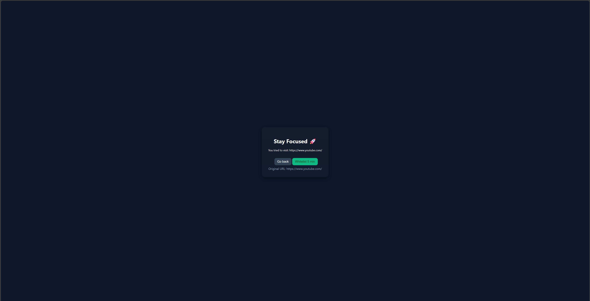
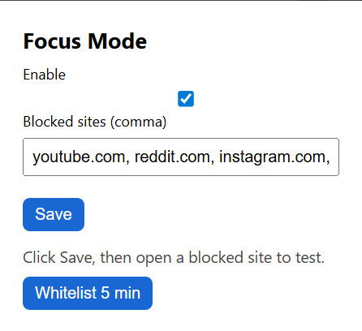

# Focus Mode for Procrastinators 🚀

A Chrome extension designed to help students and professionals stay focused by blocking distracting websites. Take control of your productivity with customizable site blocking and temporary whitelist features.




## Features

- **Smart Site Blocking**: Automatically blocks distracting websites (YouTube, Reddit, Instagram, TikTok by default)
- **Temporary Whitelist**: Need to check something quickly? Whitelist a site for 5 minutes
- **Customizable Block List**: Add or remove sites from your block list
- **Toggle On/Off**: Easily enable or disable focus mode when needed
- **Clean Interface**: Simple, distraction-free design



## Installation

### Install from Source (Developer Mode)

1. Clone this repository or download the ZIP file:
   ```bash
   git clone https://github.com/yourusername/focus-mode-extension.git
   ```

2. Open Chrome and navigate to `chrome://extensions/`

3. Enable **Developer mode** using the toggle in the top-right corner

4. Click **Load unpacked** and select the extension folder

5. The Focus Mode icon should now appear in your Chrome toolbar

## Usage

### Basic Setup

1. Click the Focus Mode icon in your toolbar
2. Enable the extension using the checkbox
3. Add or remove sites from the blocked list (comma-separated)
4. Click **Save**

### Temporary Whitelist

When you need to access a blocked site temporarily:

**Method 1 - From the blocked page:**
- Navigate to a blocked site
- Click the "Whitelist 5 min" button on the blocked page

**Method 2 - From the popup:**
- Open the Focus Mode popup
- Navigate to the site you want to whitelist
- Click "Whitelist 5 min" in the popup

### Options Page

Right-click the extension icon and select "Options" to access advanced settings where you can manage your blocked sites list.

## Default Blocked Sites

The extension comes pre-configured to block:
- youtube.com
- reddit.com
- instagram.com
- tiktok.com

You can customize this list at any time through the popup or options page.

## File Structure

```
focus-mode-extension/
│
├── manifest.json          # Extension configuration
├── background.js          # Service worker for blocking logic
├── blocked.html           # Page shown when site is blocked
├── blocked.js             # Script for blocked page interactions
├── popup.html             # Extension popup interface
├── popup.js               # Popup logic
├── options.html           # Options page
├── content.js             # Content script (placeholder)
├── style.css              # Popup styling
├── README.md              # This file
│
└── icons/                 # Extension icons
    ├── icon16.png
    ├── icon48.png
    └── icon128.png
```

## How It Works

1. **Navigation Monitoring**: The extension listens for navigation events using `chrome.webNavigation.onBeforeNavigate`
2. **URL Matching**: When you navigate to a URL, it checks if the hostname matches any blocked sites
3. **Redirection**: Blocked sites are redirected to a local `blocked.html` page
4. **Temporary Access**: The whitelist feature stores expiration timestamps in local storage, allowing temporary access

## Development

### Technologies Used

- Manifest V3 (latest Chrome extension format)
- Vanilla JavaScript
- Chrome Extension APIs (storage, tabs, webNavigation, scripting)

### Key APIs

- `chrome.storage.local`: Stores settings and whitelist data
- `chrome.webNavigation.onBeforeNavigate`: Intercepts navigation attempts
- `chrome.tabs`: Manages tab updates and redirects

## Contributing

Contributions are welcome! Here's how you can help:

1. Fork the repository
2. Create a feature branch (`git checkout -b feature/AmazingFeature`)
3. Commit your changes (`git commit -m 'Add some AmazingFeature'`)
4. Push to the branch (`git push origin feature/AmazingFeature`)
5. Open a Pull Request

### Ideas for Contribution

- Add scheduling features (block sites only during certain hours)
- Statistics dashboard showing time saved
- Different blocking modes (soft warnings vs hard blocks)
- Sync settings across devices
- Custom block messages

## Privacy

This extension:
- Stores all data locally using `chrome.storage.local`
- Does NOT collect or transmit any browsing data
- Does NOT track user activity
- Does NOT connect to external servers

## Known Limitations

- Only works in Chrome (not compatible with other browsers without modification)
- Cannot block incognito mode without additional permissions
- Requires reload after changing settings for some sites

## Troubleshooting

**Extension not blocking sites:**
- Ensure the extension is enabled in the popup
- Check that the site is in your blocked list
- Try refreshing the page after saving settings

**Whitelist not working:**
- Make sure you're clicking the button for the correct site
- Check that you're on the site's main domain (not a subdomain)

## License

This project is licensed under the MIT License - see the [LICENSE](LICENSE) file for details.

## Acknowledgments

- Designed for students and professionals seeking better focus
- Built with modern Chrome Extension Manifest V3
- Inspired by the need for simple, effective productivity tools

## Support

If you find this extension helpful, please:
- ⭐ Star this repository
- 🐛 Report bugs via GitHub Issues
- 💡 Suggest features via GitHub Issues

## Roadmap

- [ ] Add statistics and analytics dashboard
- [ ] Implement scheduled blocking
- [ ] Create preset focus modes (Deep Work, Study, etc.)
- [ ] Add password protection for settings
- [ ] Browser notification when trying to access blocked sites
- [ ] Export/import settings

---

**Made with focus by students, for students** 🎓
